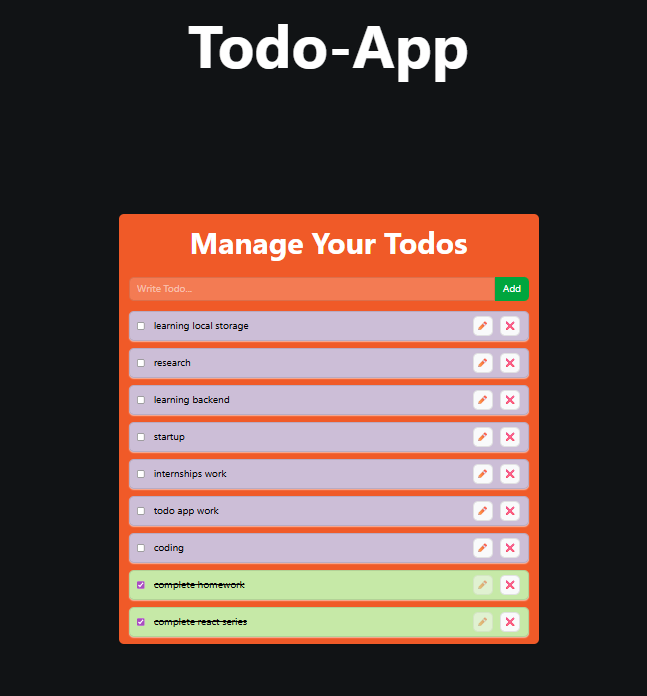

# 📝 Todo-App

A simple and functional Todo application built with **React.js** to practice and demonstrate core React concepts such as **Context API, Hooks, Props, state management, and Local Storage**.

The project allows users to create, edit, delete, and mark todos as completed. Todos are persisted in the browser using Local Storage, so they remain available after refreshing the page.

## 🎥 Demo

<!-- Add your GitHub video attachment here -->

## ✨ Features

* ➕ Add new todos
* ✏️ Edit existing todos
* 🗑️ Delete todos
* ✅ Mark todos as completed
* 💾 Persist todos using Local Storage
* 🔄 Automatically load saved todos on page refresh
* ⚛️ Global state management using React Context API
* 🎨 Responsive UI built with Tailwind CSS

## 🧠 React Concepts Practiced

This project was built as a learning project to understand how different React concepts work together.

### ⚛️ Context API

Used **React Context API** to share todo-related state and functions between components without manually passing them through multiple levels of props.

The context provides:

* `todos`
* `addTodo`
* `updateTodo`
* `deleteTodo`
* `toggleComplete`

### 🪝 React Hooks

The project uses several React Hooks:

#### `useState`

Used to manage the application's todo state.

```jsx
const [todos, setTodos] = useState([])
```

#### `useEffect`

Used for synchronizing the application state with Local Storage.

```jsx
useEffect(() => {
    const todos = JSON.parse(localStorage.getItem("todos"))

    if (todos && todos.length > 0) {
        setTodos(todos)
    }
}, [])
```

Another `useEffect` saves the current todos whenever the state changes.

```jsx
useEffect(() => {
    localStorage.setItem("todos", JSON.stringify(todos))
}, [todos])
```

### 📦 Props

Props are used to pass todo data from the parent component to individual todo components.

For example:

```jsx
<TodoItem todo={todo} />
```

This allows each `TodoItem` component to work with its corresponding todo.

### 💾 Local Storage

The browser's Local Storage API is used to persist todos.

This means:

```text
Add Todo
    ↓
React State
    ↓
Local Storage
    ↓
Refresh Page
    ↓
Restore Todos
```

## 🏗️ Project Structure

```text
src/
├── assets/
│
├── components/
│   ├── index.js
│   ├── TodoForm.jsx
│   └── TodoItem.jsx
│
├── context/
│   ├── index.js
│   └── TodoContext.js
│
├── App.css
├── App.jsx
├── index.css
└── main.jsx
```

## 🔄 Application Flow

The application follows a simple state-management flow:

```text
                    App.jsx
                       │
                       ▼
                TodoProvider
                       │
          ┌────────────┴────────────┐
          │                         │
          ▼                         ▼
      TodoForm                  TodoItem
          │                         │
          │                         │
          ▼                         ▼
      Add Todo              Edit / Delete / Complete
          │                         │
          └────────────┬────────────┘
                       ▼
                  todos state
                       │
                       ▼
                 Local Storage
```

## 🛠️ Technologies Used

* **React.js**
* **JavaScript (ES6+)**
* **Tailwind CSS**
* **Vite**
* **React Context API**
* **Local Storage API**

 

## 🚀 Getting Started

### 1. Clone the repository

```bash
git clone <your-repository-url>
```

### 2. Navigate into the project

```bash
cd <project-folder>
```

### 3. Install dependencies

```bash
npm install
```

### 4. Start the development server

```bash
npm run dev
```

The application will be available at the local development URL provided by Vite.

## 📚 What I Learned

Through this project, I practiced:

* Managing state with `useState`
* Running side effects with `useEffect`
* Creating and consuming Context
* Sharing state between components
* Passing data through props
* Building reusable React components
* Working with browser Local Storage
* Handling CRUD operations in React
* Structuring a React project into components and contexts
* Using Tailwind CSS for styling

## 🎯 Project Purpose

This project was created as part of my **React learning journey** to strengthen my understanding of state management and component communication before moving toward larger React applications.

It focuses on understanding **how React concepts work together**, rather than simply building a Todo application.

## 🔮 Future Improvements

Potential improvements include:

* 🔐 User authentication
* 📅 Todo deadlines and reminders
* 🏷️ Categories and tags
* 🔍 Search and filtering
* 📊 Todo statistics
* 🌐 Backend/database integration
* 📱 Improved mobile UI
* 🌙 Theme switching

## 👨‍💻 Author

**Muhammad Akif Naveed**

Software Engineering Student | Aspiring AI Engineer

---

⭐ If you found this project useful, feel free to explore the repository and follow my learning journey.
